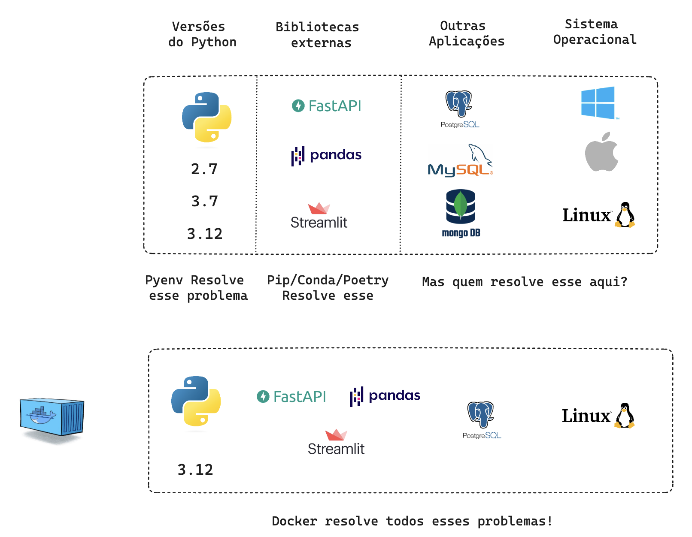
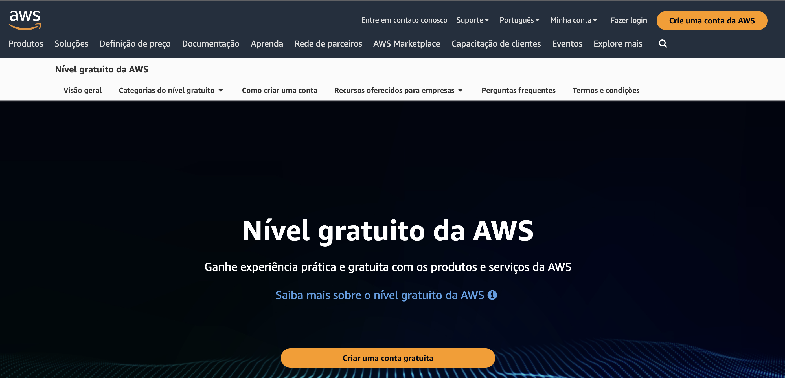
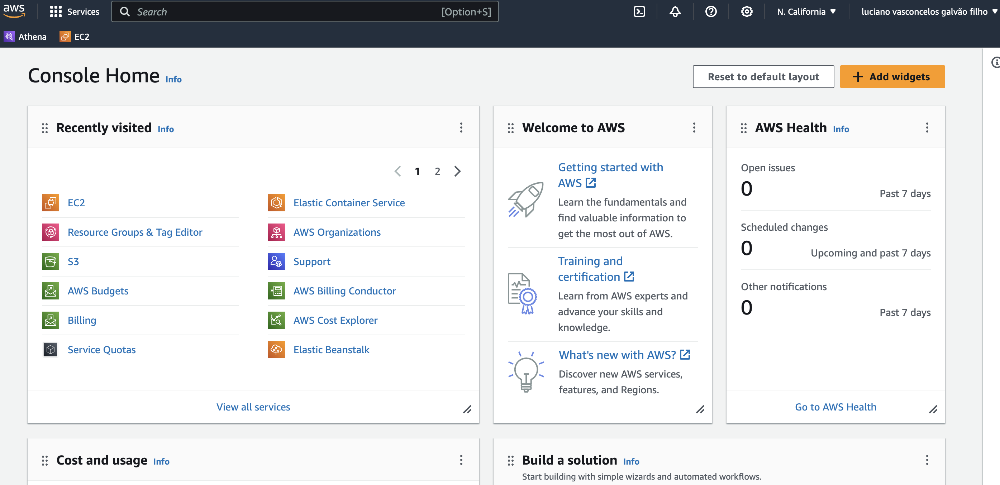

# Do Jupyter Notebook pro Deploy em Prod

Repositório do Workshop

## Docker

Imagine que você tem uma aplicação que tenha Python 3.7, Pandas 2.1, Stremlit 1.4, FastAPI 0.1.7, Postgres 16 e você utiliza um Mac. 


- Como você garante que essa aplicação vai funcionar em todos os sistemas? Afinal você não trabalha sozinho.

- Como garantir que o seu amigo que tem um Mac vai conseguir rodar sua aplicação?
  
- Como garantir que o seu servidor de produção em Linux vai conseguir rodar sua aplicação?

Essa é a razão do famigerado "na minha máquina funciona"


O Docker é uma ferramenta que permite a criação de ambientes isolados para a execução de aplicações. Isso significa que, ao utilizar o Docker, você pode GARANTIR QUE SUA APLICAÇÃO IRÁ FUNCIONAR da mesma forma em diferentes ambientes, seja no seu computador com windows, do seu colega de trabalho com Mac e no servidor de desenvolvimento ou no servidor de produção em Linux.

É um mundo utópico onde todos os sistemas operacionais funcionam da mesma forma. E isso é possível graças ao Docker.


Independente de onde sua aplicação vai estar rodando, você pode garantir que ela vai funcionar da mesma forma.

Parece surreal não é mesmo? Mas é real!

Ele trabalha com o conceito de contêineres, que são ambientes isolados que contém tudo que sua aplicação precisa para funcionar. Isso inclui o sistema operacional, as bibliotecas, as dependências e tudo mais que for necessário. 

Para engenheiros e analistas de dados, entender e aplicar essa prática significa garantir que as aplicações de processamento de dados e APIs desenvolvidas sejam robustas, consistentes e seguras. A utilização de contêineres permite a criação de ambientes isolados que são cruciais para testes e produção de modelos de análise de dados, garantindo que as aplicações funcionem igualmente bem em diferentes infraestruturas e estágios de desenvolvimento.



### Instalação do Docker

- [Instalação Docker](https://docs.docker.com/engine/install/ubuntu/)


### O que é uma imagem?

Você só precisa configurar uma imagem uma vez e, a partir dela, pode criar quantos containers quiser.

Uma imagem é um pacote executável que inclui tudo o que é necessário para executar uma aplicação - o código, um tempo de execução, bibliotecas, variáveis de ambiente e configurações. As imagens se tornam containers em tempo de execução e, no caso do Docker, as imagens se tornam containers quando executadas no Docker Engine. Os containers do Docker são executados sempre no modo isolado, garantindo que os processos em execução no container não interfiram e nem acessem os processos em execução no host e vice-versa.

### Comandos básicos

- `docker ps`: Lista os containers em execução no momento.

- `docker ps -a`: Lista todos os containers, independentemente de estarem em execução ou não.

- `docker run NOME_DA_IMAGEM`: Cria um container com a respectiva imagem passada como parâmetro.

- `docker run -it NOME_DA_IMAGEM`: Conecta o terminal que estamos utilizando com o do container.

## FastAPI

[Projeto FastAPI](https://github.com/lvgalvao/API-Do-Jupyter-Notebook-Pro-Deploy)

##  Airflow

O Apache Airflow é uma plataforma projetada para criar, agendar e monitorar fluxos de trabalho de forma programática.

Quando os fluxos de trabalho são definidos como código, eles se tornam mais fáceis de manter, versionar, testar e colaborar.

Utilize o Airflow para compor fluxos de trabalho como grafos acíclicos dirigidos (DAGs) de tarefas. O agendador do Airflow executa suas tarefas em uma série de workers respeitando as dependências definidas. Ferramentas de linha de comando abrangentes facilitam a realização de operações complexas nos DAGs. A interface de usuário intuitiva permite visualizar facilmente os pipelines em execução, monitorar o progresso e resolver problemas quando necessário.

O Airflow é especialmente útil em contextos de engenharia de dados e ciência de dados, pois permite a automação e a orquestração de processos complexos de tratamento de dados, treinamento de modelos de machine learning, execução de ETLs e muito mais. Tudo isso contribui para uma gestão mais eficiente do ciclo de vida dos dados e dos modelos preditivos.

## User Interface

- **DAGs**: Visão deral do seu ambiente.

  

- **Grid**: Visão de todas as execuções de um DAG.

  

- **Graph**: Visão de todas as tarefas de um DAG e suas dependências.

  

- **Task Duration**: Tempo de execução de cada tarefa de um DAG.

  

- **Gantt**: Duração de cada execução de um DAG.

  

- **Code**: Código de cada DAG.

  

### Instalação do Airflow em uma máquina EC2 AWS sem Docker

Este README fornece instruções passo a passo para instalar o Apache Airflow em uma instância EC2 da Amazon usando Ubuntu como sistema operacional. Certifique-se de ter as permissões adequadas e o acesso SSH à sua instância EC2 antes de começar.

Caso tenha dúvidas, visitar a [documentação](https://airflow.apache.org/docs/apache-airflow/stable/start.html)

### Criar conta na AWS

1. Criar uma [conta na AWS](https://www.googleadservices.com/pagead/aclk?sa=L&ai=DChcSEwjAsan6qK2CAxWznVoFHQsWDoQYABAAGgJ2dQ&ase=2&gclid=EAIaIQobChMIwLGp-qitggMVs51aBR0LFg6EEAAYASAAEgKmIvD_BwE&ohost=www.google.com&cid=CAASJORoDeOFQkYZaTPYRdzliq9Zx_XBUo7PjMlTDdyGYQmvH8K9Gg&sig=AOD64_3UuKgxK2EF8RXgITpJ7PsabxFV0A&q&nis=4&adurl&ved=2ahUKEwjhmp_6qK2CAxU6rpUCHSP5D5QQ0Qx6BAgGEAE) e fazer o login.

- **Página inicial**: Página home sem login.



- **Página inicial**: Página home após cadastro e logi



2. Criar uma instancia EC2.

A máquina EC2 é um servidor virtual na nuvem da Amazon Web Services (AWS) que fornece capacidade computacional escalável. Utilizamos no Airflow para hospedar e executar fluxos de trabalho de forma flexível e confiável, aproveitando a infraestrutura elástica da AWS.

3. Instalando o Airflow na nossa máquina

Fazer update, instalar sqlite e python na máquina virtual

```bash
sudo apt update

sudo apt install python3-pip

sudo apt install sqlite3

sudo apt install python3.10-venv

sudo apt-get install libpq-dev
```

Criar um ambiente virtual de Python

```bash
python3 -m venv .venv

source .venv/bin/activate
```

Configurar o Home do Airflow

```bash
export AIRFLOW_HOME=~/airflow
```

Instalar o Airflow fazendo bruxaria

```bash
AIRFLOW_VERSION=2.7.2

PYTHON_VERSION="$(python --version | cut -d " " -f 2 | cut -d "." -f 1-2)"

CONSTRAINT_URL="https://raw.githubusercontent.com/apache/airflow/constraints-${AIRFLOW_VERSION}/constraints-${PYTHON_VERSION}.txt"

pip install "apache-airflow==${AIRFLOW_VERSION}" --constraint "${CONSTRAINT_URL}"
```

Rodar o Airflow

```bash
airflow db migrate

airflow users create \
    --username admin \
    --firstname Peter \
    --lastname Parker \
    --role Admin \
    --email spiderman@superhero.org

airflow webserver &

airflow scheduler
```

4. Acessar o Airflow no seu IP na porta 8080

5. Acessando via SSH

No terminal digitar

```bash
ssh ubuntu@<Public IPv4 address>
```

Vai dar acesso negado

``` 
Permission denied (publickey).
```

Previsamos de uma chave para acessar a máquina EC2. Para isso, vamos conectar com a chave que criamnos anteriormente.

```bash
ssh -i <path-to-key> ubuntu@<Public IPv4 address>
```

Vai dar erro de permissão

```bash
@@@@@@@@@@@@@@@@@@@@@@@@@@@@@@@@@@@@@@@@@@@@@@@@@@@@@@@@@@@
@         WARNING: UNPROTECTED PRIVATE KEY FILE!          @
@@@@@@@@@@@@@@@@@@@@@@@@@@@@@@@@@@@@@@@@@@@@@@@@@@@@@@@@@@@
Permissions 0644 for 'airflow-workshop.pem' are too open.
It is required that your private key files are NOT accessible by others.
This private key will be ignored.
```

```bash
chmod 0400 <path-to-key>
```

Tentar novamente e

```
ssh -i <path-to-key> ubuntu@<Public IPv4 address>
```

Tudo certo!

Obs: Caso use [Windows verificar esse tutorial aqui](https://www.youtube.com/watch?v=kzLRxVgos2M)


6) Acessar pelo VScode

## Acesso ao Airflow

Após iniciar o servidor web e o agendador, você pode acessar a interface do Airflow em seu navegador, usando o endereço IP da sua instância EC2 seguido pela porta `8080`. Por exemplo: `http://<EC2-IP-ADDRESS>:8080`.

Acessar pelo VScode

Certifique-se de que a porta `8080` está aberta no grupo de segurança associado à sua instância EC2.
